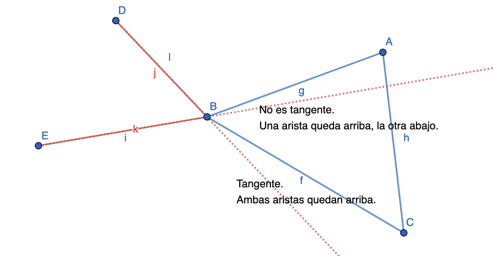

## Grafo de visibilidad

Emmanuel A. Larralde Ortiz

## Descripción del problema

Se tiene un ambiente en un plano euclideano con un conjunto de $n$ obstáculos poligonales separados, y dos puntos $s$, $t$ que se encuentran fuera de los obstáculos. Se quiere determinar el camino más corto libre de obstáculos desde $s$ hasta $t$

## Afirmación

El camino más corto libre de obstáculos es un conjunto de segmentos poligonales cuyos vértices son los vértices de los obstáculos o los puntos $s$ y $t$. Estos vértices son parte del conjunto de vértices del grafo de visibilidad.

## Grafo de visibilidad

Es un grafo en el cual cada nodo representa un vértice de los polígonos o los puntos $s$ y $t$, y las aristas son las conexiones visibles entre tales vértices.

Decimos que dos puntos $p$, $q$ son mutuamente visibles si el segmenton que los une no intersecta el interior de ningún obstáculo. 

Para construir el grafo de visibilidad, se recorren todos los vértices y se determinan qué vértices son visibles a partir de cada uno, tal cómo se muestra en la figura 1.

<figure>
    
    <figcaption>
        Figura 1. Grafo de visibilidad de un ambiente con obstáculos poligonales.
    </figcaption>
</figure>

A partir del grafo de visibilidad, se pueden determinar los caminos posibles del punto $s$ (*start*) al punto $t$ (*goal*). Utilizando información de la distancia euclideana con respecto a cada vértice, es posible determinar el camino cuya distancia euclideana total sea la mínima utilizando algoritmos bien conocidos.

### Construyendo un grafo de visibilidad

En la literatura, existen varios métodos para construir un grafo de visibilidad, pero en esta sección se revisará con más profundidad los detalles de programación.

#### Construcción del ambiente.

Retomando el ambiente de simulación desarrollado con `Pygame` y `OpenGL` que fue utilizado en la tarea 1, cada polígono se construye como una serie de puntos en órden horario. Es de suma importancia conservar el orden en el cuál se conectan los vértices para construir las aristas como conexiones entre puntos adyacentes en una lista de puntos. Por otro lado, es importante que todos los polígonos lleven el mismo órden (horario o antihorario), pues el orden es de importancia para identificar vértices cóncavos.

El inicio y la meta del ambiente son dos puntos independientes a cualquier polígono.

<figure>
    
    <figcaption>
        Figura 2. Obstáculos y vértices en el ambiente de simulación.
    </figcaption>
</figure>

#### Procedimiento general

Se tiene una matriz de incidencia cuadrada $M_{n +2 \times n + 2}$, donde $n$ es la cantidad de vértices que tienen todos los polígonos. Dado a que no es un grafo dirigido, entonces $M$ es simétrica. En realidad, sólo nos interesa rellenar los elementos que se encuentran debajo de la diagonal. Se tienen $n+2$ vértices $v_i$ en total. Por practicidad $v_{n+1}$ corresponde al punto de salida y $v_{n+2}$ corresponde a la meta. Entonces todos los demás vértices son los vértices de los polígonos y la submatriz $M_{1:n,1:n}$ corresponden a las conexiones entre los vértices de los polígonos. El renglón $M_{n+1, :}$ corresponde a las conexiones de la salida y el renglón $M_{n+2, :}$ corresponde a las conexiones de la meta.

Para cada vértice en el ambiente, se revisan qué otros vértices son visibles con respecto a cada uno. Si lo son, se conectan. La conexión se representa a través de la matriz de incidencia. En el elemento del renglón $i$ y la columna $j$ se escribe la distancia euclideana entre los vértices $i$ y $j$ si son visibles, en caso contrario se escribe -1, es decir, 

$$
M_{ij} =
    \begin{cases}
      dist(v_i, v_j), & \text{if visibles} \\
      -1, & \text{otherwise}
    \end{cases}
$$

Se considera que los polígonos son estáticos, entonces cuando inicia el programa se rellenan los elementos de la matriz que corresponden a todos los pares entre vértices de polígonos, es decir, todos los elementos debajo de la diagonal de la submatriz $M_{1:n,1:n}$. Estos elementos nunca se modificarán después.

Los puntos de inicio y meta sí pueden cambiar, entonces por separado se actualizan las dos filas que corresponden a ambos puntos (fila $M_{n + 1,:}$ para la salida y fila $M_{n + 2,:}$ para la meta). Cuando inicia el programa se calculan estas filas y se actualiza alguna de las filas cuando su punto respectivo (salida o meta) es modificado.

#### Cálculo de la visibilidad

Los polígonos son los únicos objetos que pueden obstruir la visibilidad, y son contenidos por sus aristas. Considere el conjunto de todas las aristas de todos los polígonos en el ambiente. Se dice que los vértices $v_i$ y $v_j$ no son visibles si existe al menos una arista de polígono que intersecta con el segmento de recta que une a los puntos $v_i$ y $v_j$.

Para determinar si un segmento de recta es intersectado por una arista dada (que también es un segmento de recta), consideramos las ecuaciones de ambas rectas:

$$
\begin{align*}
    y &= m_1x + b_1 &(1)\\
    y &= m_2x + b_2 &(2)
\end{align*}
$$

Donde $m_i$ y $b_i$ pueden calcularse tomando los dos vértices que construyen al segmento o la arista.

Si los segmentos no son paralelos, entonces existe un punto $(x_a, y_a)$ en el que cruzan las dos rectas definidas por la ecuación de arriba. En este caso, conocer $x_a$ es suficiente.

$$
x_a = \frac{b_2 - b_1}{m_1 - m_2}
$$

Y si los dos segmentos están definidos en $x_a$, entonces el punto $(x_a, y_a)$ existe en ambos segementos y, por lo tanto, se intersectan y hay una obstrucción de la visibilidad.

<figure>
    
    <figcaption>
        Figura 3. Simulación del grafo de visibilidad completo.
    </figcaption>
</figure>

## Grafo de visibilidad reducido

El grafo de visibilidad normal tiene muchas conexiones que no serían utilizados en ninguna situación, por ejemplo, aquellas que se dirigen hacia los obstáculos. Para reducir el tiempo de ejecución del cálculo del camino más corto se eliminan aquellas conexiones que no son necesarias.

### Construcción del grafo de visibilidad reducido.

Una vez construido el grafo de visibilidad normal, se inicia un proceso de filtrado para eliminar aristas que se consideran que en ninguna situación se utilizarían para calcular el camino más corto.

Podría tomarse la decisión de conservar todas las aristas y vértices de los polígonos debido a que definen los límites físicos del obstáculo (lo cual es necesario para evitar colisiones), pero para el alcance de esta tarea podemos eliminar los vértices cóncavos. Un vértice cóncavo de un polígono tiene un ángulo interior mayor a 180°.

Con respecto a las conexiones entre vértices de dos polígonos, se descartan todas aquellas que no sean bitangentes y sobre las conexiones entre un punto (salido o meta) y un polígono se descartan todas aquellas que no sean tangentes al obstáculo en el que terminan. Si existe una conexión directa entre la salida y la meta, esta siempre se conserva.

#### Determinando si una recta es (bi)tangente

Un segmento es tangente a un polígono si este polígono se encuentra en uno de sus extremos y y las dos aristas adyacentes al vértice del polígono (donde termina el segmento) quedan del mismo lado con respecto al segmento, tal como se muestra en la figura 4.

<figure>
    
    <figcaption>
        Figura 4. El segmento DB es tangente al polígono ABC porque las aristas CB y BA quedan del mismo lado de la recta que contiene a DB. La recta EB no lo es.
    </figcaption>
</figure>

Por otro lado, se define como recta bitangente a dos obstáculos si en sus extremos coincide con los vértices de estos dos obstáculos y es tangente con cada uno de ellos.

En el programa, se determina si una recta es tangente utilizando el producto cruz de los vectores que forman los segmentos. Si las aristas están del mismo lado, entonces el producto cruz de cada arista con respecto al segmento de conexión producirá un vector con el mismo sentido. Si no, tendrán sentidos opuestos.

## Experimentos

En este [video](https://youtu.be/X8EhI1nT33o) se muestran pruebas de ambos algoritmos en 3 escensarios diferentes.
